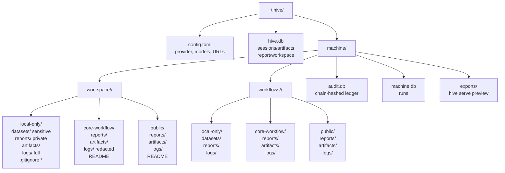
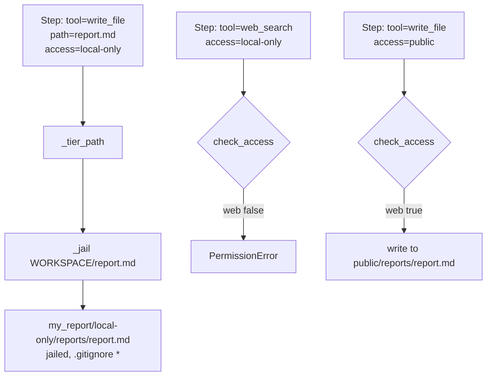

# Folder Documentation — Hive Research CLI

> Complete map of **source**, **runtime**, and **per-workflow 3-tier** folders. All paths are local-first; no cloud.

---

## 1. Source Tree (`hive-research-CLI/`)

```
hive-research-CLI/
├── Dockerfile                 # multi-stage: node:20 webbuild → python:3.11 runtime, ENTRYPOINT docker-entrypoint.sh
├── docker-compose.yml         # hive (8002:8000) + ollama (11436:11434) + open-webui (3001:8080), volumes hive_data etc., bind ${HOME}/.hive
├── .dockerignore              # __pycache__, .hive, web/node_modules, !web/dist
├── .gitignore                 # **/local-only/** never committed + __pycache__, .venv, .hive, web/node_modules
├── pyproject.toml             # hive, hive-research, hive-machine entry points; deps: typer, httpx, textual, pyyaml, recharts
├── README.md                  # quickstart + CLI/TUI/Machine + web
├── DOCUMENTATION.md           # 14-section full docs (architecture → troubleshooting)
├── docs/
│   ├── HIVE_MACHINE.md        # 15-section deep dive with 6 mermaid diagrams
│   └── FOLDERS.md             # this file — full folder map
├── hive/
│   ├── __init__.py            # __version__
│   ├── cli.py                 # Typer app: rank/paper/ask/deepresearch/.../report/tui/serve/web + machine sub-app (workflow/audit/dashboard/nvidia) + REPL
│   ├── config.py              # AppConfig/LLMConfig, ~/.hive/config.toml + env, Nvidia 8011
│   ├── llm/
│   │   ├── base.py            # ChatMessage, ChatResponse, LLMProvider
│   │   ├── ollama.py         # OllamaProvider 11434 /api/tags + /api/chat streaming
│   │   ├── lmstudio.py       # LMStudioProvider 1234/v1/models + /v1/chat/completions
│   │   ├── nvidia.py         # NvidiaProvider 8011/v1 + nvidia-smi, DEFAULT_NIM_URLS [8011,8001,8000]
│   │   └── client.py         # get_provider() auto Ollama→LM Studio→Nvidia + _fallback_model + chat/chat_stream
│   ├── papers/
│   │   ├── schemas.py         # Paper Pydantic
│   │   ├── openalex.py        # OpenAlex /works search + inverted abstract
│   │   ├── arxiv.py           # arXiv https export + feedparser
│   │   ├── crossref.py        # Crossref /works/{doi}
│   │   ├── europe_pmc.py      # Europe PMC search + fullTextXML
│   │   ├── rank.py            # PaperRank 0-100 deterministic
│   │   └── resolver.py        # resolve DOI/arXiv/OpenAlex/title + fetch_full_text
│   ├── research/
│   │   ├── prompts.py         # SYSTEM + 10 workflow templates + RANK_RESCORING
│   │   ├── workflows.py       # search_and_rank, enrich_full_text, run_workflow
│   │   ├── report.py          # generate_deep_report() 20-section Feynman parity
│   │   └── session.py         # SQLite ~/.hive/hive.db: sessions/artifacts
│   ├── tui/
│   │   └── app.py             # HiveTUI Textual (16 items, RichLog, Input, Header status)
│   ├── machine/               # Hive-Machine — Perplexity Computer
│   │   ├── __init__.py        # MACHINE_DIR, WORKSPACE, HISTORY_DB, AUDIT_DB, WORKFLOWS_DIR, workflow_base/dirs()
│   │   ├── access.py          # TIERS local-only/core-workflow/public, ALLOW, check_access(), ensure_workflow_dirs()
│   │   ├── tools.py           # 8 audited tools + _jail() + dispatch_tool() → audit.log_event
│   │   ├── sensitive.py       # classify pii/secret/critical + redact
│   │   ├── audit.py           # audit.db chain-hashed ledger, severity 1-5, impact 0-100, verify_chain
│   │   ├── nvidia_pair.py     # discover_all(), pick_best(), get_provider_for()
│   │   ├── workflows.py       # YAML/JSON workflows, _tier_path(), 3-tier ensure, EXAMPLE_AI_AGENTS
│   │   ├── dashboard.py       # CLI tables + Textual AuditDashboardApp
│   │   ├── agent.py           # SYSTEM, _extract_tool, run_task() loop max_steps 12
│   │   └── app.py             # HiveMachineApp Textual (file tree, chat, preview)
│   ├── web/
│   │   ├── __init__.py
│   │   └── server.py          # WebHandler /api/health/models/audit/stats/verify/sessions/workflows/files/nvidia + web/dist SPA
│   └── utils/rich.py
├── web/                       # TSX dashboard (Vite + React 18 + TS + Recharts)
│   ├── package.json           # vite, react, recharts
│   ├── vite.config.ts         # proxy /api→:8000
│   ├── tsconfig.json
│   ├── index.html             # root #Hive Research - A Local research companion & Hive-Machine
│   ├── dist/                  # built 571k JS (committed, served by hive/web)
│   └── src/
│       ├── main.tsx
│       ├── App.tsx            # tabs Research/Machine, StatusCards, AuditCharts, LogsPanel
│       ├── api.ts             # AuditEvent, Stats, ModelInfo types + fetch
│       └── components/
│           ├── StatusCards.tsx  # 5 cards (ollama/lmstudio/nvidia 8011 optional yellow)
│           ├── AuditCharts.tsx  # 4 Recharts (severity, tool, impact timeline, pie)
│           └── LogsPanel.tsx    # audit table filter tool/severity
├── openwebui/
│   ├── hive_tools.py          # 13 Tools + Valves
│   ├── hive_pipe.py           # Pipe auto-inject
│   └── README.md
├── scripts/
│   ├── docker-entrypoint.sh   # seeds /root/.hive from /host_hive if volume empty
│   ├── backup.sh              # tar host ~/.hive + volumes
│   └── restore.sh             # restore host/volume
└── tests/
    ├── test_cli.py
    ├── test_config.py
    ├── test_llm.py
    └── test_rank.py
```

---

## 2. Runtime Tree (`~/.hive/` — host, bind-mounted to Docker `/root/.hive`)



### 2.1 `~/.hive/config.toml`

```toml
[llm]
provider = "auto" # ollama|lmstudio|nvidia|auto
ollama_url = "http://localhost:11434"
ollama_model = "llama3.1:8b"
lmstudio_url = "http://localhost:1234/v1"
lmstudio_model = "qwen/qwen3.8-27b"
nvidia_url = "http://localhost:8011/v1"  # 8011 to avoid 8000/8001
nvidia_model = "meta/llama3-8b-instruct"
temperature = 0.3
max_tokens = 4096
```

### 2.2 `~/.hive/hive.db`

```sql
sessions(id, topic, created_at, updated_at, summary)
artifacts(id, session_id, kind, title, content, created_at)
-- kind: deep_report, deepresearch, lit, etc.
```

### 2.3 `~/.hive/machine/` — 3-tier per workflow

**Every workflow `<name>` gets 6 directories (3 in `workflows/<name>/` + 3 in `workspace/<name>/`), each with 3 tiers:**

| Tier | Location | Contents | Git | Web/Commit | Logs |
|---|---|---|---|---|---|
| **local-only** | `workflows/<name>/local-only/` + `workspace/<name>/local-only/` | `datasets/` (sensitive), `reports/private.md`, `logs/full.log` | `*` ignored | ❌ no web, no commit, no copies | Full (secrets kept, never redacted, `sensitivity=critical` → severity 5) |
| **core-workflow** | `.../core-workflow/` | `reports/report.md`, `artifacts/`, `logs/` | `README` allowed | ✅ web + commit | Redacted (`sensitive.redact`) |
| **public** | `.../public/` | `reports/`, `artifacts/`, `logs/` | `README` allowed | ✅ | Public |

**Creation:** `hive/machine/__init__.py:1` `workflow_dirs(name)` → `access.ensure_workflow_dirs(base)` creates:

```
local-only/datasets, reports, artifacts, logs + .gitignore (*,!.gitignore)
core-workflow/reports, artifacts, logs + README.md
public/reports, artifacts, logs + README.md
```

Called on `save_workflow()` and `run_workflow()` (`hive/machine/workflows.py:1`).

**Path mapping** `workflows.py:1` `_tier_path(workflow, access, path)`:

- `write_file path: report.md` + `access: local-only` → `my_report/local-only/reports/report.md` (jailed via `WORKSPACE`)
- `path: datasets/private.csv` + `local-only` → `.../local-only/datasets/private.csv`
- `path: data.json` + `core-workflow` + `.log` → `.../core-workflow/logs/data.json`



**Enforcement** `hive/machine/access.py:1`:

```python
TIERS = ("local-only","core-workflow","public")
ALLOW = {
  "local-only":    {"web":False, "commit":False, "copy_out":False, "log_sensitive":True},
  "core-workflow": {"web":True,  "commit":True,  "copy_out":True,  "log_sensitive":False},
  "public":        {"web":True,  "commit":True,  "copy_out":True,  "log_sensitive":False},
}
WEB_TOOLS = {"web_search","web_fetch"}
COMMIT_PATTERNS = ["git commit","git push",...]
check_access(tool, access, args): raise PermissionError if not allowed
```

Called in `workflows.py:1` before `dispatch_tool` and `llm_chat`.

---

## 3. Docker Persistence

```mermaid
graph TD
    Host[Host ~/.hive<br/>48K audit.db, 32K hive.db] -->|bind HOME /.hive:/root/.hive| Container[/root/.hive<br/>hive_data volume<br/>host_hive:ro]
    Container -->|entrypoint: if empty, cp -a /host_hive/. /root/.hive| Volume[hive_data<br/>survives down/build]
    Container -->|down -v deletes| Del[⚠️ only down -v deletes volumes]
    Host -->|scripts/backup.sh| Tar[backups/hive-host-*.tar.gz<br/>+ hive_data/ollama_data tar]
```

- `docker-compose.yml:50` `hive` volumes: `- ${HOME}/.hive:/root/.hive` (primary, host persistent) + `- ${HOME}/.hive:/host_hive:ro` (seed fallback)
- `Dockerfile:1` `ENTRYPOINT [docker-entrypoint.sh]` seeds volume if empty
- `scripts/backup.sh` / `restore.sh` for `down -v` safety

**Verify:**

```bash
hive machine workflow run test_simple  # → core-workflow/reports/test_simple.md
ls -R ~/.hive/machine/workspace/test_simple
# local-only/  core-workflow/  public/  (each with datasets/reports/logs)
cat ~/.hive/machine/workspace/test_simple/local-only/.gitignore # *
hive machine audit --limit 5  # shows access tier per event
```

---

## 4. Web Dashboard Folders

- `web/dist/` — built TSX (571k JS, committed, served by `hive/web/server.py:1` at `http://localhost:8002`)
- `web/src/` — source TSX (App, api, StatusCards, AuditCharts, LogsPanel)

---

## 5. Ignored (Never Committed)

```
# .gitignore
**/local-only/**
**/local-only
local-only/
__pycache__/
*.pyc
.hive/
web/node_modules/
```

This ensures `local-only` (datasets, private reports, full logs with secrets) never reaches git, even inside workflows.

---

*See `docs/HIVE_MACHINE.md:1` for full Hive-Machine guide (15 sections, mermaid).*
