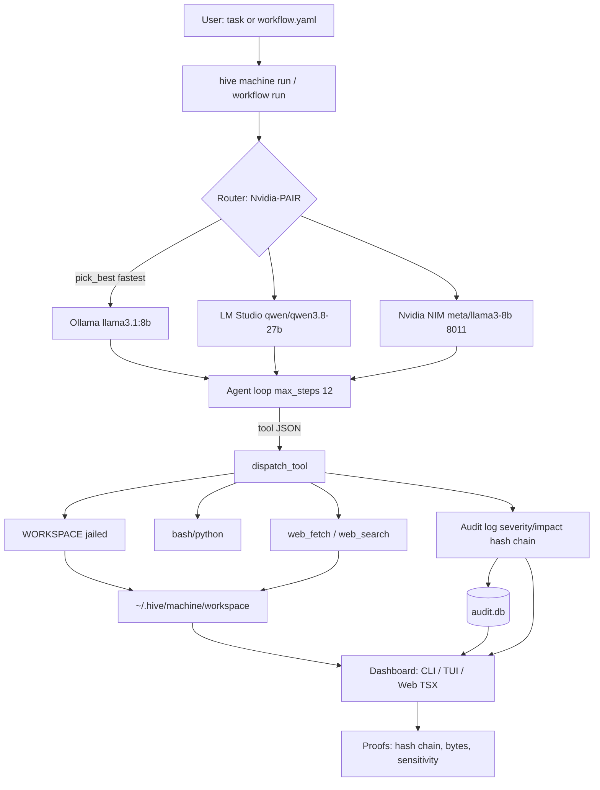
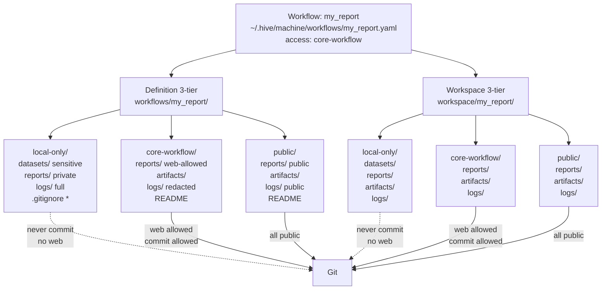
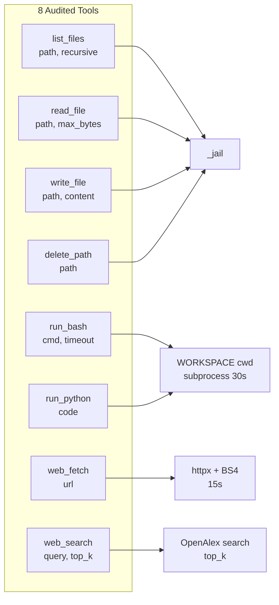
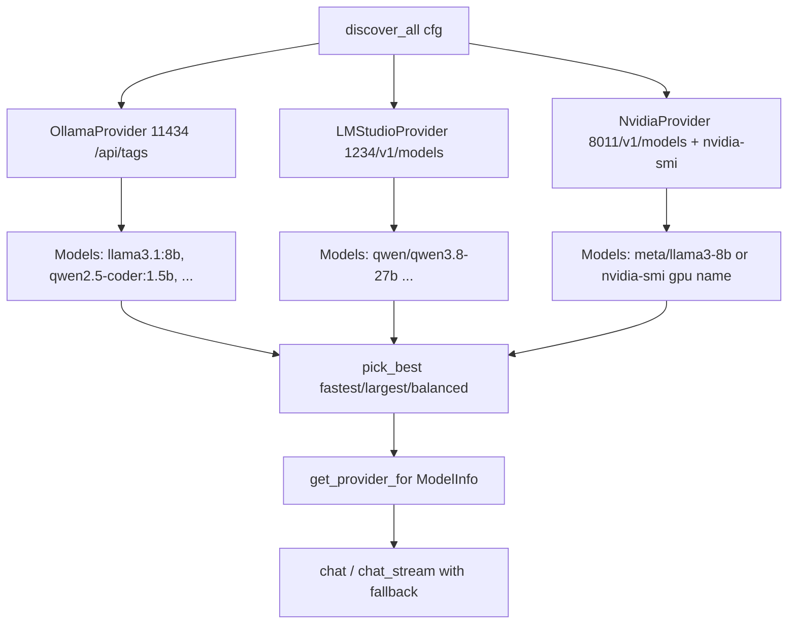
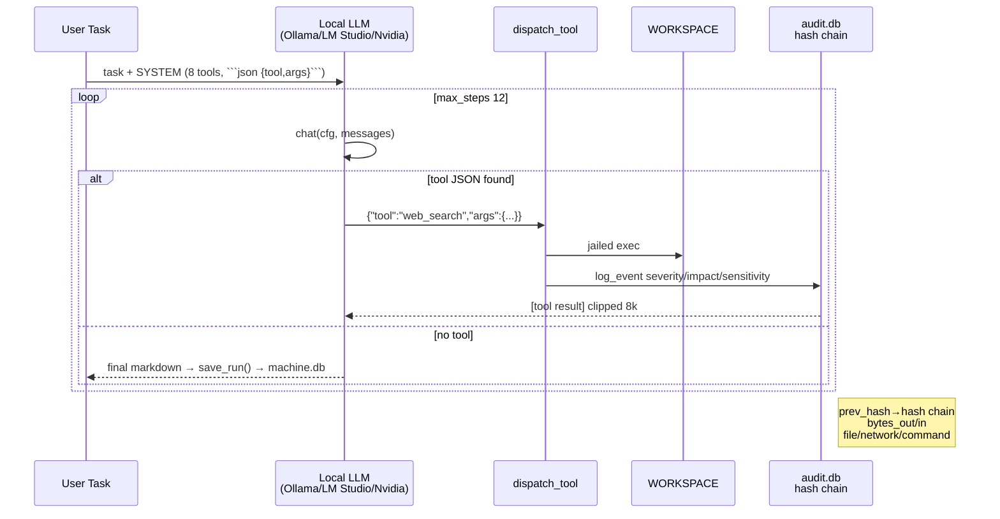
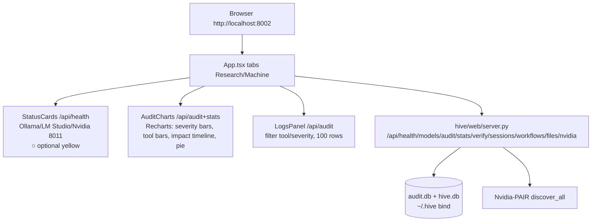

# Hive-Machine — Complete Guide

> **Local Perplexity Computer** — sandboxed `~/.hive/machine/workspace` (jailed, no escape), 8 tools, local LLM only (Ollama / LM Studio / Nvidia NIM via **Nvidia-PAIR**), audited proofs, end-to-end workflows, and web dashboard. No cloud.

**For:** `hive machine` (CLI) + `hive-machine` (alias) + TUI (`hive machine`/`hive machine tui`) + web `http://localhost:8002` + Docker.

---

## Table of Contents

1. [Overview & Design](#1-overview--design)
2. [Architecture](#2-architecture)
3. [Workspace & Sandbox](#3-workspace--sandbox)
4. [Tools (8)](#4-tools-8)
5. [Nvidia-PAIR — Local-First Model Router](#5-nvidia-pair--local-first-model-router)
6. [Agent Loop (Single Task)](#6-agent-loop-single-task)
7. [User-Defined Workflows (End-to-End)](#7-user-defined-workflows-end-to-end)
8. [Sensitive Data & Audit Proofs](#8-sensitive-data--audit-proofs)
9. [Dashboards (CLI, TUI, Web)](#9-dashboards-cli-tui-web)
10. [Persistence & Docker](#10-persistence--docker)
11. [CLI Reference](#11-cli-reference)
12. [TUI Guide](#12-tui-guide)
13. [Web Dashboard (TSX)](#13-web-dashboard-tsx)
14. [Worked Examples (AI Agents)](#14-worked-examples-ai-agents)
15. [Troubleshooting](#15-troubleshooting)

---

## 1. Overview & Design

Hive-Machine turns a local LLM into a **computer user**: it can list/read/write/delete files, run `bash`/`python` in `~/.hive/machine/workspace`, fetch/search the web, and chain these via an audited agent loop or a declarative YAML workflow. Every action is hash-chained (`prev_hash→hash`), scored (`severity 1-5`, `impact 0-100`), and classified for secrets/PII.

**Local-first:** `HIVE_PROVIDER=auto` → Ollama → LM Studio → Nvidia NIM (all `localhost`, never egress). Sensitive data is redacted; network is only OpenAlex/arXiv/Europe PMC/web_fetch (public).

---

## 2. Architecture

### 2.1 Module map

```
hive/machine/
  __init__.py        # MACHINE_DIR=~/.hive/machine, WORKSPACE=.../workspace, AUDIT_DB=.../audit.db, WORKFLOWS_DIR=.../workflows
  tools.py           # 8 tools + _jail() + dispatch_tool() audited
  sensitive.py       # regex classify pii/secret/critical + redact
  audit.py           # sqlite chain-hashed ledger, severity/impact, verify_chain, export_proofs
  nvidia_pair.py     # discover_all() Ollama+LM Studio+NIM, pick_best(fastest/largest/balanced)
  workflows.py       # YAML/JSON workflows, VAR ${id}, llm steps via Nvidia-PAIR
  dashboard.py       # CLI tables + Textual AuditDashboardApp
  agent.py           # SYSTEM prompt, _extract_tool, run_task(task, max_steps=12) loop
  app.py             # HiveMachineApp Textual (file tree, chat, preview)
hive/llm/
  nvidia.py          # NvidiaProvider (OpenAI-compatible, 8011 first)
  client.py          # get_provider() auto + fallback, chat()/chat_stream()
hive/web/server.py   # /api/health/models/audit/stats/verify/sessions/workflows/files/nvidia + serves web/dist
web/src/             # TSX: App.tsx, api.ts, StatusCards, AuditCharts, LogsPanel (Recharts)
```

### 2.2 High-level flow



### 2.3 Data & trust boundaries

```mermaid
flowchart LR
    subgraph Host [Host: macOS]
        HWS[~/.hive/machine/workspace<br/>~/.hive/machine/audit.db<br/>~/.hive/hive.db]
        HS[Host Ollama 11434<br/>Host LM Studio 1234]
    end
    subgraph Container [Docker hive:8002]
        CWS[/root/.hive<br/>bind ${HOME}/.hive:/root/.hive<br/>rebuild-safe]
        CDB[(hive_data volume<br/>fallback)]
        API[Web API 8000<br/>/api/health/audit/...]
    end
    subgraph Web [Browser http://localhost:8002]
        TSX[TSX Dashboard<br/>Recharts + Logs]
    end
    HWS <-->|bind mount| CWS
    CDB -.->|seed if empty| CWS
    API --> TSX
    HS --> API
    TSX -->|no egress| HWS
```

---

## 3. Workspace & Sandbox

**Path:** `~/.hive/machine/workspace` (`hive/machine/__init__.py:1` `WORKSPACE`). **Jail** `tools.py:15` `_jail(path)`:

```python
p = (WORKSPACE / Path(path)).resolve()
if not str(p).startswith(str(WORKSPACE.resolve())):
    raise ValueError("path escapes workspace")
```

All 8 tools use `_jail`. `list_files`, `read_file`, `write_file`, `delete_path` are jailed; `run_bash`/`run_python` `cwd=WORKSPACE` with `timeout 30s`; `write_file` auto `mkdir -p` parent.

**Related DBs:**
- `~/.hive/machine/audit.db` — chain-hashed `audit` table (see §8)
- `~/.hive/machine/machine.db` — `runs(id, task, created, steps, final)` from `agent.py:1`
- `~/.hive/hive.db` — research sessions (shared with Research Companion)
- `~/.hive/machine/workflows/*.yaml` — user workflows

---

## 3b. 3-Tier Folder Structure (Every Workflow)

Every workflow `<name>` gets **3 isolated tiers** — enforced by `hive/machine/access.py:1` + `hive/machine/__init__.py:1` `workflow_dirs()`:



| Tier | Path Example | Web | Commit | Copy Out | Logs | Use For |
|---|---|---|---|---|---|---|
| **local-only** | `~/.hive/machine/workspace/<wf>/local-only/datasets/private.csv` | ❌ `web_search/web_fetch` blocked, `llm_web` blocked | ❌ `git commit/push` blocked, `no copies` | ❌ | Full (with secrets) `.gitignore *` | Sensitive datasets, private reports, full logs with secrets |
| **core-workflow** | `~/.hive/machine/workspace/<wf>/core-workflow/reports/report.md` | ✅ | ✅ (allowed to commit) | ✅ | **Redacted** (private datapoints removed via `sensitive.redact`) | Web research, commits, public repos (excluding private) |
| **public** | `~/.hive/machine/workspace/<wf>/public/reports/report.md` | ✅ | ✅ | ✅ | Redacted/public | Public reports, artifacts for sharing |

**Enforcement** `hive/machine/access.py:1` `ALLOW` + `check_access(tool, access, args)`:

```mermaid
flowchart TD
    S[Step: tool=web_search<br/>access=local-only<br/>args={query: AI}] --> C{check_access}
    C -->|web false| E[PermissionError: no web in local-only]
    S2[Step: tool=run_bash<br/>cmd=git commit -m ...<br/>access=local-only] --> C2{check_access}
    C2 -->|commit false| E2[PermissionError: no commit]
    S3[Step: tool=write_file<br/>access=core-workflow] --> C3{check_access}
    C3 -->|web true, commit true| OK[dispatch_tool → audit log<br/>sensitivity critical→ severity 5]
    OK --> R[Write to tiered path<br/>_tier_path wf/tier/reports/file.md]
```

- `hive/machine/workflows.py:1` `_tier_path()` maps `path: report.md` + `access: local-only` → `my_report/local-only/reports/report.md` (jailed via `WORKSPACE`), creates 3-tier via `ensure_workflow_dirs()` on `save_workflow` + `run_workflow`.
- `.gitignore:1` `**/local-only/**` + `**/local-only` ensures `local-only` never committed.
- `audit.py:1` logs `access` tier, `sensitivity` (critical for local-only secrets), `severity` 5 for blocked attempts.

**Example YAML:**

```yaml
name: ai_agents_report
access: core-workflow  # default for workflow
steps:
  - id: search
    tool: web_search
    args: {query: "AI Agents", top_k: 5}
    access: core-workflow  # web allowed
  - id: private_ingest
    tool: write_file
    args: {path: "datasets/private.csv", content: "id,secret\n1,abc"}
    access: local-only     # → workspace/ai_agents_report/local-only/datasets/private.csv (no web, no commit)
  - id: public_report
    tool: write_file
    args: {path: "report.md", content: "# Public\n${search}"}
    access: public         # → workspace/ai_agents_report/public/reports/report.md (public)
```

**Verify:**

```bash
hive machine workflow run ai_agents_report
# → 3-tier workspace: .../local-only (local-only, .gitignore *) | .../core-workflow (web+commit) | .../public (public)
ls -R ~/.hive/machine/workspace/ai_agents_report
# local-only/datasets  core-workflow/reports  public/reports
cat ~/.hive/machine/workspace/ai_agents_report/local-only/.gitignore # *
hive machine audit --limit 10  # shows access tier per event
```

## 4. Tools (8)



| Tool | Args | Returns (truncated) | Audited |
|---|---|---|---|
| `list_files` | `path=".", recursive=false` | `rel [dir/file N B]` (200 max) | bytes_out/in, file_path |
| `read_file` | `path, max_bytes=50000` | text or `[binary hex]` | sensitivity check |
| `write_file` | `path, content` | `wrote N chars → path` | high severity if secret |
| `delete_path` | `path` | `deleted` | severity 4 |
| `run_bash` | `cmd, timeout=30` | `exit code\nstdout[stderr]` (20k cap) | dangerous `rm -rf/sudo` → severity 5 |
| `run_python` | `code, timeout=30` | via `run_bash python3 _machine_exec.py` | — |
| `web_fetch` | `url, max_chars=15000` | BS4 stripped `script/style` text | network_url, bytes |
| `web_search` | `query, top_k=5` | OpenAlex papers: `title (year) doi cites — abstract` | network |

Registry `tools.py:60` `TOOL_SCHEMAS`/`DISPATCH`, `dispatch_tool(name, **kwargs)` logs via `audit.log_event`.

---

## 5. Nvidia-PAIR — Local-First Model Router

PAIR = **Provider-Aware Intelligent Router** (`hive/machine/nvidia_pair.py:1`).



- `discover_all()` probes all three, returns `List[ModelInfo(provider, model, url, healthy, extra)]`
- `pick_best(prefer=fastest)` sorts `1.5b<3b<7b<8b<13b<27b<70b` → fastest local; `balanced` prefers `llama3.1:8b`
- `get_provider_for()` returns `OllamaProvider`/`LMStudioProvider`/`NvidiaProvider`
- `hive/config.py:25` `DEFAULT_NVIDIA_URL 8011` (avoids 8000/8001 conflicts), `hive/llm/nvidia.py:1` `DEFAULT_NIM_URLS [8011,8001,8000]`, health returns `not running (optional — no GPU/NIM, use Ollama/LM Studio)` on 404 (macOS has no GPU → dashboard shows `○ optional` yellow, not red)
- `hive/llm/client.py:1` `get_provider()` auto `Ollama→LM Studio→Nvidia`, `chat()` fallback on 404 via `_fallback_model()`

CLI: `hive machine nvidia` (table Provider/Model/URL/Healthy/Extra + `nvidia-smi`), `hive config --provider nvidia --nvidia-model ...`, workflow `llm: {provider: auto}` uses `pick_best`.

---

## 6. Agent Loop (Single Task)

`hive/machine/agent.py:1` `SYSTEM` — local Perplexity Computer, one JSON tool per turn:



- `_extract_tool()` regex ` ```json {"tool":...} ``` `
- `run_task(task, cfg, max_steps=12)` — `get_provider().health()` check, loop `chat` → `_extract_tool` → `dispatch_tool` → append `assistant` + `user [tool result]` → continue; on `max_steps` force summarize
- `save_run()` → `machine.db` `runs`, `list_history()`

Example: `hive machine run "list files and summarize README"` → `list_files` → `read_file` → final.

---

## 7. User-Defined Workflows (End-to-End)

Declarative YAML/JSON in `~/.hive/machine/workflows/*.yaml` (`hive/machine/workflows.py:1`).

```mermaid
graph TD
    WF[workflow.yaml<br/>name, steps[]] --> LD[_load_workflow]
    LD --> Loop{For each step}
    Loop --> V[_resolve_vars ${id} from context]
    V --> L{llm?}
    L -->|yes| R[Router pick_best<br/>chat prompt]
    R --> O[outputs[id]=llm text]
    L -->|no| T[tool dispatch]
    T --> O2[outputs[id]=tool result]
    O --> C[context update]
    O2 --> C
    C --> Loop
    Loop --> E[elapsed + audit]
```

**Schema:**

```yaml
name: ai_agents_report
description: AI Agents research — local-first, audited
steps:
  - id: search
    tool: web_search
    args: {query: "AI Agents", top_k: 5}
  - id: summarize
    llm: {provider: auto, prompt: "Summarize ${search} into 5 bullets:\n${search}"}
  - id: write
    tool: write_file
    args: {path: "ai_agents_report.md", content: "# AI Agents\n\n${summarize}\n\n---\n*Generated ${search}*"}
  - id: verify
    tool: read_file
    args: {path: "ai_agents_report.md"}
```

- `VAR_RE \${([^}]+)}` resolves `${search}`/`${steps.search}`/`${steps.search.outputs}` from `context`
- `_resolve_args()` handles strings
- `llm` step uses Nvidia-PAIR `pick_best` + `chat()` + `audit.log_event(tool=llm_chat)`
- `tool` step uses `dispatch_tool()` + `audit` with `workflow_id`
- `run_workflow(name|path, cfg, extra_vars, dry_run)` returns `{workflow, outputs, context, elapsed, audit}`

CLI:

```bash
hive machine workflow example   # creates ai_agents_report.yaml
hive machine workflow list      # table Name/Path
hive machine workflow run test_simple              # 0.0s write+read
hive machine workflow run ai_agents_report --dry-run # llm still runs, tools dry
hive machine workflow run ai_agents_report          # 4.7s real (web_search 5 papers)
```

---

## 8. Sensitive Data & Audit Proofs

### 8.1 Sensitive classifier `hive/machine/sensitive.py:1`

```mermaid
graph LR
    T[text] --> R[regex]
    R -->|api_key sk-| C[critical]
    R -->|private_key| C
    R -->|credit_card/ssn| S[secret]
    R -->|email| P[pii]
    R -->|none| N[none 0]
    C & S & P --> L[level + hits]
    L --> RD[redact -> [REDACTED]]
```

Patterns: `api_key (sk-…, ghp_, AKIA)`, `private_key`, `hf_token`, `aws_secret`, `credit_card`, `ssn`, `email`. `classify()` → `(level, hits)`, `redact()` replaces.

### 8.2 Audit ledger `hive/machine/audit.py:1`

Table `audit` (`AUDIT_DB=~/.hive/machine/audit.db`):

| Col | Meaning |
|---|---|
| `ts` | `time.time()` |
| `tool` | `list_files` etc. or `llm_chat` |
| `args` | JSON |
| `result_preview` | first 2k |
| `bytes_out/in`, `file_path`, `network_url`, `command` | outflow/proof |
| `severity` 1-5 | `SEVERITY_MAP` + `DANGEROUS_BASH` `rm -rf/sudo` →5, secrets →5, large fetch →+1 |
| `impact` 0-100 | `severity * radius *10` (radius: path+1, recursive+2, bytes>10k/50k, result>20k) |
| `sensitivity` | `pii/secret/critical` from `sensitive.py` |
| `prev_hash`, `hash` | `sha256(prev + payload)` chain, `payload=ts+tool+args+severity+impact+level` |
| `workflow_id`, `model` | correlation |

```mermaid
graph TD
    E[Tool call] --> S[_severity tool+args+result]
    S --> I[_impact severity*radius]
    I --> C[classify sensitivity]
    C --> H[prev_hash = last hash or 0*16]
    H --> P[payload = ts+tool+args+sev+imp]
    P --> N[hash = sha256(prev+payload)[:16]]
    N --> DB[(audit.db insert)]
    DB --> VC[verify_chain: prev_hash == expected]
```

- `log_event(tool, args, result, bytes_out/in, file_path, network_url, command, workflow_id, model)` called from `tools.dispatch_tool` and `workflows`/`agent` (every tool)
- `query_audit(limit, tool, min_severity)`, `stats()` (by_tool counts/sum/avg), `verify_chain()` checks `prev_hash` chain, `export_proofs(path)` JSON

**Proof example:** `hive machine audit --limit 3` shows `ID Time Tool File/Network Bytes Severity Impact Hash Sensitivity`, `verify_chain ✓ chain ok 16 events`.

---

## 9. Dashboards (CLI, TUI, Web)

### 9.1 CLI

```bash
hive dashboard --limit 50          # top-level: full dashboard (audit + network + files + commands)
hive machine audit --limit 50 --min-severity 3 --export audit.json --verify
hive machine nvidia                # GPU + models table
hive dashboard                      # alias
```

`dashboard.py:1` `render_audit_table()`, `render_network_dashboard()` (web_fetch/search → Bytes Out/In), `render_file_dashboard()` (list/read/write/delete → unique paths), `render_command_dashboard()` (run_bash/python), `render_full_dashboard()`.

### 9.2 TUI

- **Research** `hive/tui/app.py:1` `HiveTUI` — menu 16 items (Rank, Paper, Ask, ... Deep Report), `RichLog` output, `Input` query/top, `Header` LLM status, `Footer` bindings, `_run_report` via `generate_deep_report`
- **Machine** `hive/machine/app.py:1` `HiveMachineApp` — left file list (`list_files`), center chat, right preview (`read_file`), `Input` task/steps, `Header` LLM, `Footer` `q/f/r/h/?`
- **Audit** `hive/machine/dashboard.py:100` `AuditDashboardApp` — left audit log (`query_audit` 30), right stats, bottom help, `[r] refresh [e] export`

### 9.3 Web (TSX) `web/src/`



- `web/src/api.ts` types `AuditEvent`, `Stats`, `ModelInfo`, `SessionRow`, `fetch /api/*`
- `StatusCards.tsx` — 5 cards, `isOptional` → yellow `○ optional (no GPU)` not red
- `AuditCharts.tsx` — 4 Recharts from `audit(200)`: severity, tool usage, impact line (30), category pie + total
- `LogsPanel.tsx` — table with `sevColor`, filters, `bytes_out→bytes_in`, `hash[:8]`
- `App.tsx` — tabs, `verify_chain`, `sessions` (Research), `workflows` + `files` (Machine), CLI hints
- Backend `hive/web/server.py:1` `WebHandler` serves `/api/*` + `web/dist` SPA (fallback instructs `npm run build`); `run_web(host, port)` used by `hive web`/`hive serve --web`

---

## 10. Persistence & Docker

```mermaid
graph TD
    H[Host ~/.hive<br/>audit.db 48K, hive.db 32K<br/>machine/workspace] --> B[Bind ${HOME}/.hive:/root/.hive<br/>rebuild-safe]
    B --> C[Container /root/.hive<br/>hive_data named volume<br/>fallback /host_hive:ro]
    C --> E[Entrypoint<br/>if /root/.hive empty and /host_hive has data<br/>cp -a /host_hive/. /root/.hive]
    E --> S[Server hive web 8000<br/>TSX + API]
    S --> W[Web http://localhost:8002<br/>shows host's logs]
    V[hive_data volume<br/>survives down/build<br/>only down -v deletes] --> C
    B --> V
```

- `docker-compose.yml:50` `hive` volumes: `- ${HOME}/.hive:/root/.hive` (primary, host persistent, fixes empty dashboard `[]` when was `hive_data:/root/.hive` isolated) + `${HOME}/.hive:/host_hive:ro` for entrypoint seed
- `Dockerfile:1` multi-stage `node:20` webbuild → `python:3.11` runtime + `COPY scripts` + `ENTRYPOINT [docker-entrypoint.sh]` + `HEALTHCHECK curl /api/health`
- `scripts/docker-entrypoint.sh` — seeds volume if empty
- `scripts/backup.sh` / `restore.sh` — `tar czf` host `~/.hive` + volumes `hive-research-cli_hive_data/_ollama_data/_open_webui_data`
- `docker compose down` keeps volumes (and host `~/.hive`), `down -v` deletes volumes — restore via `host` (bind mount survives) or backup tar
- **Fix for lost logs:** was `hive_data` isolated empty → `curl /api/audit` `[]`; now bind host → `20 events` visible

---

## 11. CLI Reference

| Command | Purpose |
|---|---|
| `hive rank "AI Agents" --top 12 --full-text-top 3 [--no-llm]` | PaperRank (deterministic + LLM rescoring) |
| `hive paper 10.7717/peerj.4375 --fetch-full-text` | Resolver (DOI/arXiv/OpenAlex → Europe PMC) |
| `hive ask "…"` | Direct LLM chat |
| `hive deepresearch/lit/compare/review/audit/replicate/recipe/draft/autoresearch/watch` | Research workflows (11) via `workflows.py:1` |
| `hive report "AI Agents" --top 12 --depth deep` | 20-section deep report `report.py:1` → `~/.hive/machine/workspace/report_*.md` |
| `hive tui` | Research TUI 16 items |
| `hive serve / hive serve --web` / `hive web --port 8000` | Minimal / TSX web (8002 in compose) |
| `hive dashboard [--limit 50]` | Full audited dashboard (CLI) |
| `hive config --show` / `--provider` | `~/.hive/config.toml` |
| `hive models` / `hive doctor` | Local models + health |
| `hive machine` / `hive machine tui` | Machine TUI (Perplexity Computer) |
| `hive machine run "task" --steps 12` | Agent loop (tool JSON) |
| `hive machine ls/read/write/exec/python/fetch/search` | Direct workspace ops (jailed) |
| `hive machine workflow list/run/example` | YAML workflows `~/.hive/machine/workflows/` |
| `hive machine audit --limit 50 --min-severity 3 --export --verify` | Audit proofs |
| `hive machine dashboard` | Audit TUI |
| `hive machine nvidia` | Nvidia-PAIR discover + `nvidia-smi` |
| `hive machine history` | `machine.db` runs |

---

## 12. TUI Guide

**Research** `hive tui` — left menu (Rank → Deep Report), center `RichLog` markdown, bottom `Query` + `top` + `Run`, status `LLM: ollama@... ✓`, keys `q/f/s/d/?` (+ `Deep Report` → `20 sections`)

**Machine** `hive machine` → `HiveMachineApp` — left file list (`list_files`), center chat, right preview (`read_file`), bottom `Task` + `steps`, `q/f/r/h/?`, history via `h`

**Audit** `hive machine dashboard` — left audit log (30), right stats (by_tool), `r` refresh, `e` export

Tested via `run_test` pilots (`menu 16`, `filelist/task`, `audit`).

---

## 13. Web Dashboard (TSX)

**Local-first:** `web/src/App.tsx` tabs `Research`/`Machine`, `StatusCards` polls `/api/health` 8s, `AuditCharts` polls `/api/audit(200)` + `/api/stats` 5s (Recharts), `LogsPanel` polls `100` 3s with filters.

**Backend:** `hive web --port 8002` → `hive/web/server.py:1` serves `web/dist` (built `571k` JS) + `/api/*`. If `web/dist` missing, fallback HTML instructs `cd web && npm install && npm run build` and `hive serve --web`.

**Docker:** `hive:8002->8000`, `ollama:11436->11434`, `open-webui:3001->8080` to avoid host 11434/8000/3000 conflicts (`ijcb` + host Ollama). Health `ollama list` for ollama, `curl /api/health` for hive.

---

## 14. Worked Examples (AI Agents)

```bash
# 1. Research deep report (Feynman parity, 20 sections)
hive report "AI Agents" --top 12 --depth deep
# → report_aa880476.md 7.1K + artifact in hive.db — curl http://localhost:8002/api/sessions shows 6 reports

# 2. Machine end-to-end workflow (local-first, audited)
hive machine workflow example  # → ai_agents_report.yaml
hive machine workflow run ai_agents_report  # 4.7s: web_search 5 papers → llm summarize → write_file → read_file
hive machine ls && hive machine read ai_agents_report.md | head -c 600

# 3. Machine agent (single task, tool loop)
hive machine run "Use web_search to find 5 papers on AI Agents, then write ai_agents_report.md" --steps 6
# → dispatch web_search → web_search result → write_file → audit severity 2→3, impact, hash chain
hive machine audit --limit 5  # → ID Time Tool File/Network Bytes Severity Impact Hash Sensitivity
hive dashboard --limit 5      # → Total 20 events, by_tool table, verify_chain ✓

# 4. Sensitive data is redacted and scored
hive machine write secret.txt "my sk-abc123 and me@example.com" # → sensitivity critical, severity 5, impact high, redacted in logs
hive machine audit --min-severity 4  # shows critical

# 5. Nvidia-PAIR routing
hive machine nvidia  # → GPU: nvidia-smi unavailable (macOS) | Models: ollama llama3.1:8b, lmstudio qwen/qwen3.8-27b, nvidia not running (optional)
hive config --provider nvidia --nvidia-model meta/llama3-8b-instruct  # or auto (fastest)
```

---

## 15. Troubleshooting

| Symptom | Cause | Fix |
|---|---|---|
| Dashboard `[]` empty | Container isolated `hive_data` vs host `~/.hive` | Fixed to `${HOME}/.hive:/root/.hive` bind; `docker compose up -d` now shows 20 events |
| Logs lost after rebuild | `down -v` deletes named volumes | Use `down` (keeps), `host ~/.hive` survives; backup via `scripts/backup.sh ./backups` before `down -v` |
| `Nvidia NIM ✗ unreachable` red | 404 on `host.docker.internal:8000` (hive/ijcb uses 8000, macOS no GPU) | Now `8011` + health returns `not running (optional)` → yellow `○ optional (no GPU)` (`StatusCards.tsx:1`), dashboard not red; use `hive config --provider ollama` or ignore |
| `hive web` `TSX build not found` | `web/dist` not built | `cd web && npm install && npm run build` (1.23s, 833 modules) |
| `ollama list` empty | Container ollama has no models | Host Ollama has models via `host.docker.internal:11434` (bind), or `docker exec hive-ollama ollama pull llama3.1:8b` |
| `TUI shows LLM: empty` | `~/.hive/config.toml` missing / model 404 | `hive doctor` / `hive models` / `hive config --provider ollama --ollama-model llama3.1:8b` (see §5) |

---

*Generated for `hive-research 0.1.0` + `hive-machine` — run `hive doctor && hive machine nvidia && hive dashboard --limit 10 && hive machine workflow list` to verify. All LLM via Ollama/LM Studio/Nvidia NIM (8001/8000/8011), no cloud.*
